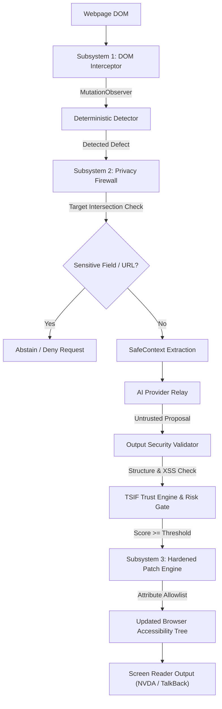

# Figure 1: System Architecture (`docs/figures/figure1_system_architecture.md`)

```mermaid
graph TD
    A["Webpage DOM"] --> B["Subsystem 1: DOM Interceptor"]
    B -->|MutationObserver| C["Deterministic Detector"]
    C -->|Detected Defect| D["Subsystem 2: Privacy Firewall"]
    D -->|Target Intersection Check| E{"Sensitive Field / URL?"}
    E -->|Yes| F["Abstain / Deny Request"]
    E -->|No| G["SafeContext Extraction"]
    G --> H["AI Provider Relay"]
    H -->|Untrusted Proposal| I["Output Security Validator"]
    I -->|Structure & XSS Check| J["TSIF Trust Engine & Risk Gate"]
    J -->|Score >= Threshold| K["Subsystem 3: Hardened Patch Engine"]
    K -->|Attribute Allowlist| L["Updated Browser Accessibility Tree"]
    L --> M["Screen Reader Output (NVDA / TalkBack)"]
```
