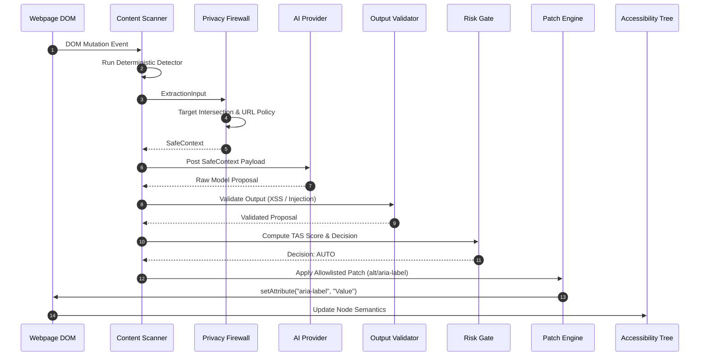

# Figure 2: Portal Transformer Sequence Pipeline (`docs/figures/figure2_remediation_pipeline.md`)

```mermaid
sequenceDiagram
    autonumber
    participant DOM as Webpage DOM
    participant Scanner as Content Scanner
    participant FW as Privacy Firewall
    participant AI as AI Provider
    participant Val as Output Validator
    participant Gate as Risk Gate
    participant Patch as Patch Engine
    participant AT as Accessibility Tree

    DOM->>Scanner: DOM Mutation Event
    Scanner->>Scanner: Run Deterministic Detector
    Scanner->>FW: ExtractionInput
    FW->>FW: Target Intersection & URL Policy
    FW-->>Scanner: SafeContext
    Scanner->>AI: Post SafeContext Payload
    AI-->>Scanner: Raw Model Proposal
    Scanner->>Val: Validate Output (XSS / Injection)
    Val-->>Scanner: Validated Proposal
    Scanner->>Gate: Compute TAS Score & Decision
    Gate-->>Scanner: Decision: AUTO
    Scanner->>Patch: Apply Allowlisted Patch (alt/aria-label)
    Patch->>DOM: setAttribute("aria-label", "Value")
    DOM->>AT: Update Node Semantics
```
